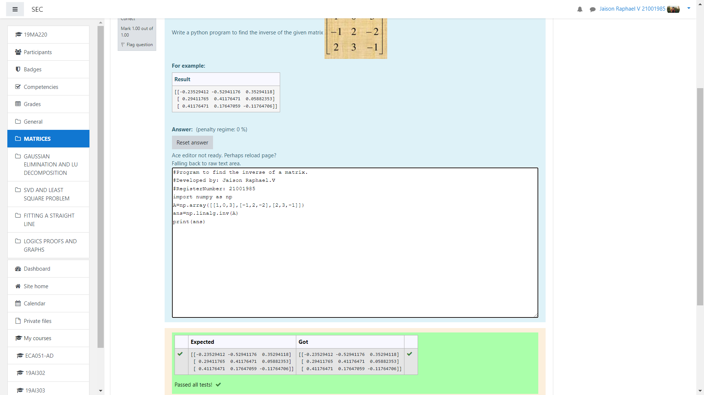

# INVERSE-OF-A-MATRIX
## Aim:
To write a python program to find the inverse of a matrix
## Equipment’s required:
1. 	Hardware – PCs
2. 	Anaconda – Python 3.7 Installation / Moodle-Code Runner
## Algorithm:
### Step1 : 
start the program.
### Step 2: 
write the codings.
### Step 3:
print the programs.
### Step 4:
end the program.

## Program:
~~~
import numpy as np
A=np.array([[1,0,3],[-1,2,-2],[2,3,-1]])
ans=np.linalg.inv(A)
print(ans)
~~~
## Output:

## Result:
Thus the inverse of given matrix is successfully solved using python program

